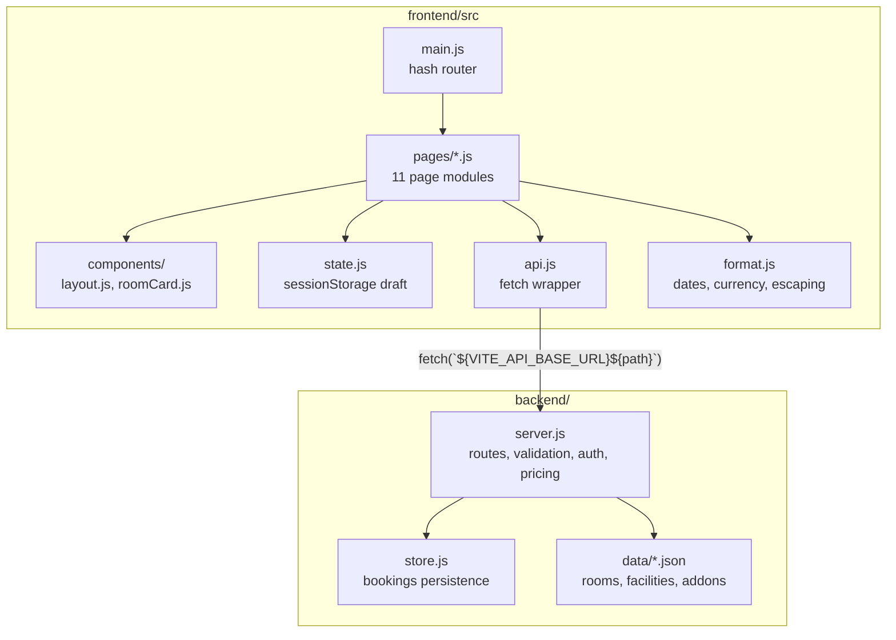
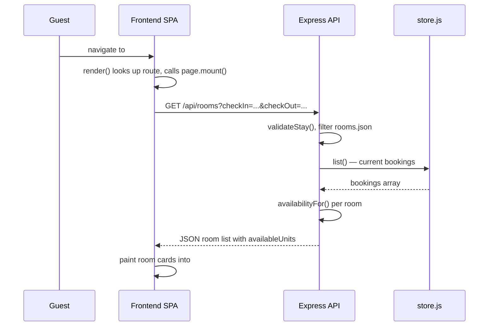
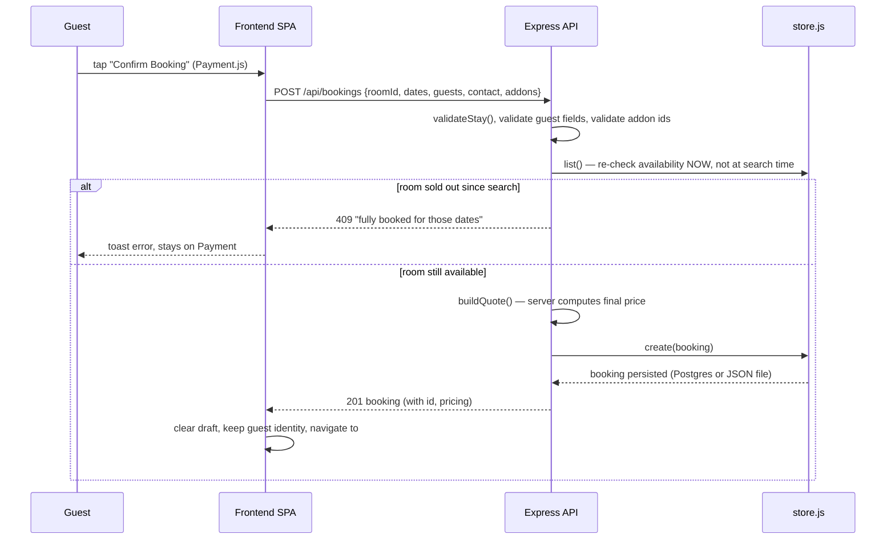
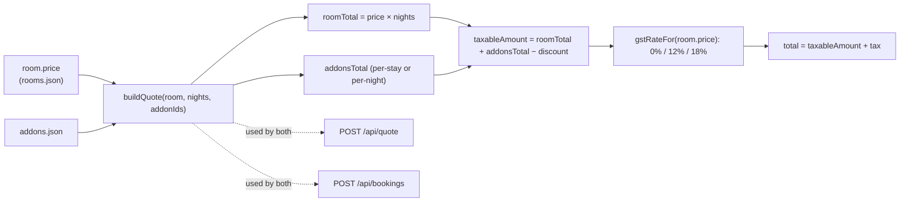
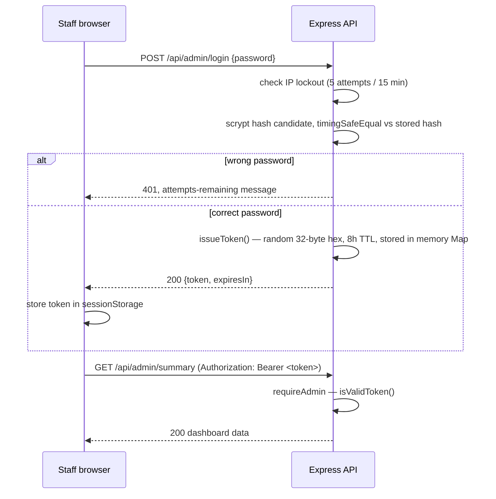
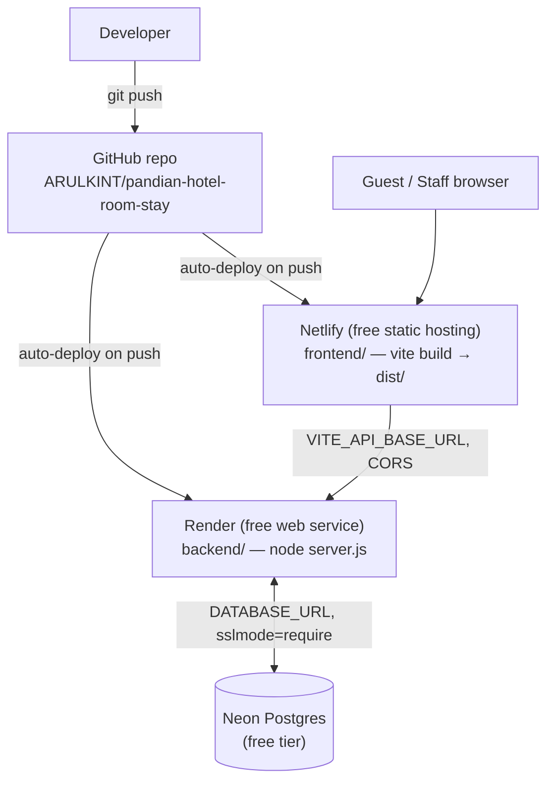

# 3. System Architecture

## 3.1 Architecture Style

The system is a **client-rendered single-page application backed by a stateless-per-request REST API**, split across two independently deployed processes:

- **Frontend**: a vanilla-JavaScript SPA (no framework) built and bundled by Vite, served as static files.
- **Backend**: a single Express.js process exposing a JSON REST API, with a pluggable persistence layer (local JSON file or Postgres).

There is no server-side rendering, no message queue, no microservices, and no background worker — this is a deliberately small, monolithic-per-tier design appropriate for a single-property hotel.

## 3.2 High-Level Architecture

```mermaid
flowchart LR
    Guest["Guest browser"] -->|HTTPS| FE["Frontend (Netlify)\nStatic SPA — Vite build"]
    Staff["Staff browser"] -->|HTTPS| FE
    FE -->|fetch() JSON, CORS| API["Backend API (Render)\nExpress.js — single process"]
    API --> Store{"store.js"}
    Store -->|DATABASE_URL set| PG[("Postgres\n(Neon / Supabase)")]
    Store -->|DATABASE_URL unset| JSON[("bookings.json\nlocal file")]
    API --> RoomsData[("rooms.json\nfacilities.json\naddons.json\n(static reference data)")]
```

**Why split hosting:** Render's and Netlify's free tiers are each best-in-class for one half of the app (Render runs a persistent Node process; Netlify serves static files with zero cold start). The two communicate purely over public HTTPS + CORS — there is no shared filesystem or private network between them. See [18-deployment.md](18-deployment.md).

## 3.3 Component Architecture



## 3.4 Request Lifecycle (typical read)



## 3.5 Request Lifecycle (booking creation — the critical path)



## 3.6 Data Flow — Pricing (single source of truth)



`buildQuote()` is called from exactly two places in `backend/server.js` — the live quote endpoint the checkout page polls on every add-on change, and the booking-creation endpoint. This is what guarantees the guest is never charged a different number than the one they were shown.

## 3.7 Authentication Flow (staff)



Full detail (hashing, lockout, token lifecycle) is in [14-authentication-security.md](14-authentication-security.md).

## 3.8 Deployment Architecture



See [18-deployment.md](18-deployment.md) for the full runbook, environment variables, and the free-tier tradeoffs (cold starts, why Postgres is optional-but-recommended).

## 3.9 Why This Architecture

| Decision | Reasoning |
|---|---|
| No frontend framework | The app is 11 pages with straightforward server-driven state; a `render()`/`mount()` convention per page module (see [05](05-project-structure.md)) gives predictable behavior without a build-time framework dependency, at the cost of more manual DOM wiring than React/Vue would need. |
| Hash-based routing (`#/rooms`) | Works on any static host with zero server-side routing configuration — critical for Netlify's static-file free tier, and it means no SPA catch-all redirect is even required (the browser never asks the server for `/rooms`, only for `/`). |
| Server computes all pricing | Prevents the classic "client price vs. server price" booking-fraud/bug class entirely, at the cost of an extra round-trip on every add-on toggle (mitigated by only refetching the quote, not the whole page). |
| Pluggable bookings store (`store.js`) | Lets the same codebase run with zero external dependencies locally (JSON file) and durably in production (Postgres), without branching the route handlers themselves. |
| In-memory sessions/rate-limiting | Simple and sufficient for a single Node process; explicitly documented as **not** safe under horizontal scaling (see [22-performance-scalability.md](22-performance-scalability.md)) rather than silently broken. |
