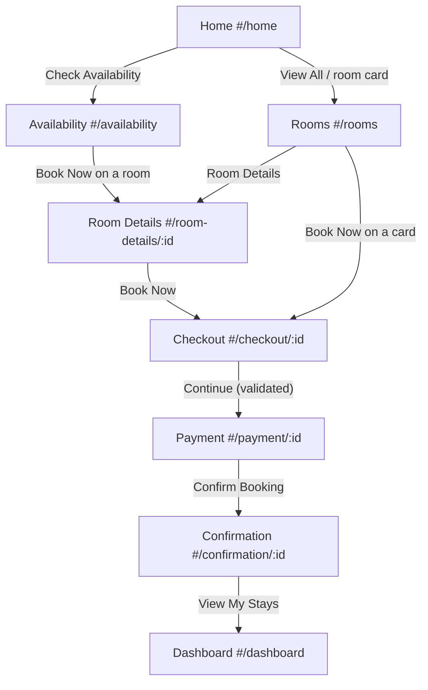
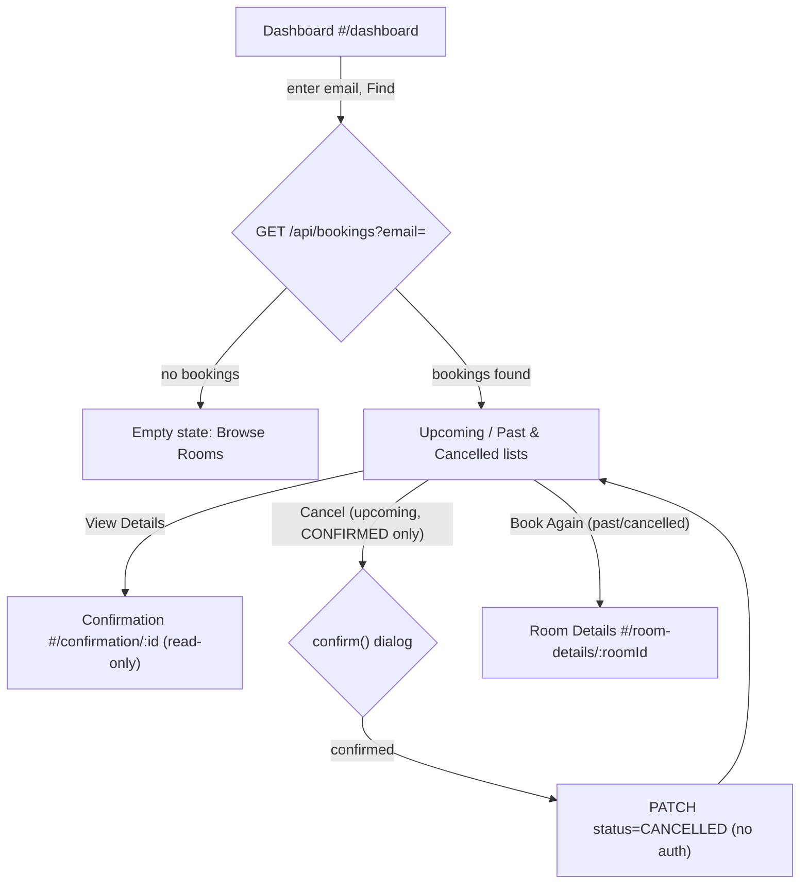
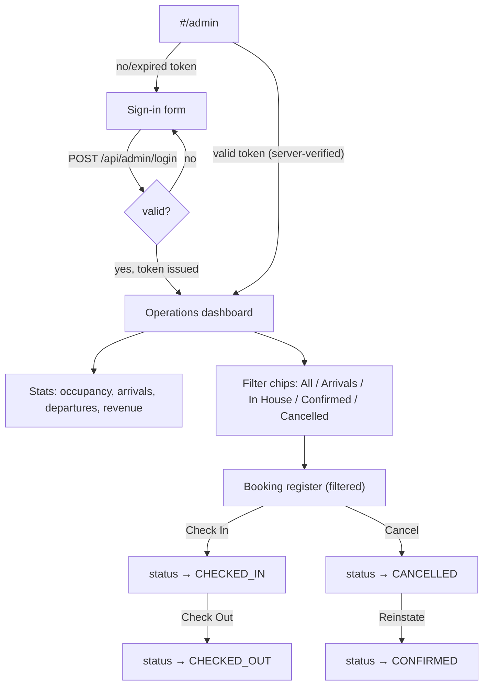
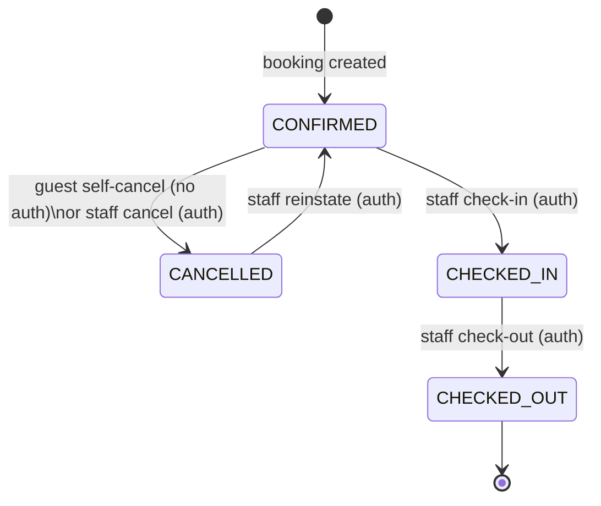

# 7. User Workflows

## 7.1 Workflow: Browse → Book a Room (primary guest flow)

1. **Starting condition**: guest lands on Home with a default draft (tomorrow → 3 nights, 2 guests) already in `sessionStorage`.
2. **User action**: adjusts dates/guests (Home widget or Availability form) and/or picks a room.
3. **System processing**: `GET /api/rooms` or `/api/availability` is called with the current stay window; the server computes `availableUnits` per room by subtracting active overlapping bookings from `totalUnits`.
4. **Database/API interaction**: on reaching Checkout, `GET /api/rooms/:id` + `GET /api/addons` load in parallel; every add-on toggle re-calls `POST /api/quote`.
5. **Result**: Payment page re-fetches the room (to catch a since-sold-out room) and the quote, then `POST /api/bookings` on confirmation.
6. **Possible errors**: room sold out between search and payment (409, own empty-state screen with a link back to Availability); guest count exceeds `room.maxGuests` (blocked before Checkout even loads); invalid email/phone (inline field errors, toast, scroll-to-error).
7. **End condition**: booking is `CONFIRMED` server-side; guest sees Confirmation with a copyable booking ID; the draft is cleared except the guest's contact identity (kept for "My Stays" convenience).

## 7.2 Workflow: Compare Rooms

1. On `#/rooms`, the guest ticks "Compare" on 2–3 room cards (client-side, capped at 3 — a 4th tick evicts the oldest via `.slice(-3)`).
2. A sticky compare bar appears once 2+ rooms are selected; tapping it navigates to `#/compare`.
3. `Compare.js` re-fetches the current room list (so prices/availability are fresh) and renders a table: price, total for stay, type, max guests, bed, size, floor, rating, availability, then a 7-row amenity checklist.
4. Guest can remove a room from the table, add another (returns to Rooms), or tap "Book Now" directly from a comparison column — which sets `roomId` on the draft and jumps straight to Checkout, skipping Room Details.

## 7.3 Workflow: Guest Self-Service (My Stays)

Bookings are split into **Upcoming** (`checkOut >= today` and not cancelled) and **Past & Cancelled**, computed client-side from the full list returned for that email. Cancellation asks for a native `confirm()` dialog before calling the API, then reloads the list.

## 7.4 Workflow: Front-Desk Operations (staff)

Every status-changing button re-loads both the stats and the register afterward, so occupancy/revenue numbers are always consistent with the register a staff member is looking at. If any call returns a 401 (expired token), the panel drops straight back to the sign-in form with a "Your session expired" message rather than showing a broken dashboard.

## 7.5 Booking Status State Machine

Note: the backend's `PATCH /api/bookings/:id` accepts any of the four statuses as a direct value (it does not enforce the state machine transitions shown above — e.g. nothing stops staff from setting `CHECKED_OUT` directly on a `CONFIRMED` booking via the API). The **UI** only ever offers the transitions drawn above; this is a client-side convention, not a server-enforced invariant — see [24-known-issues.md](24-known-issues.md).

## 7.6 Draft State Lifecycle (cross-cutting)

The "in-progress booking" (dates, guests, roomId, add-ons, guest contact fields, payment method) lives in `sessionStorage` under `phr.booking.draft` for the entire guest journey:

- **Created**: first `getDraft()` call, seeded with tomorrow → 3 nights, 2 guests, no room.
- **Updated**: every date/guest change, room selection, add-on toggle, and form-field edit calls `updateDraft()`, which re-validates the whole object through `sanitise()` before writing back.
- **Partially reset**: on successful booking, `resetDraft()` clears everything, then the guest's name/email/phone are immediately restored — so "My Stays" still has something to search with, but stale room/date selections don't leak into the next booking attempt.
- **Self-healing**: if the stored `checkIn` has slipped into the past (e.g. the tab was left open overnight), `getDraft()` silently rolls the window forward before returning it.
