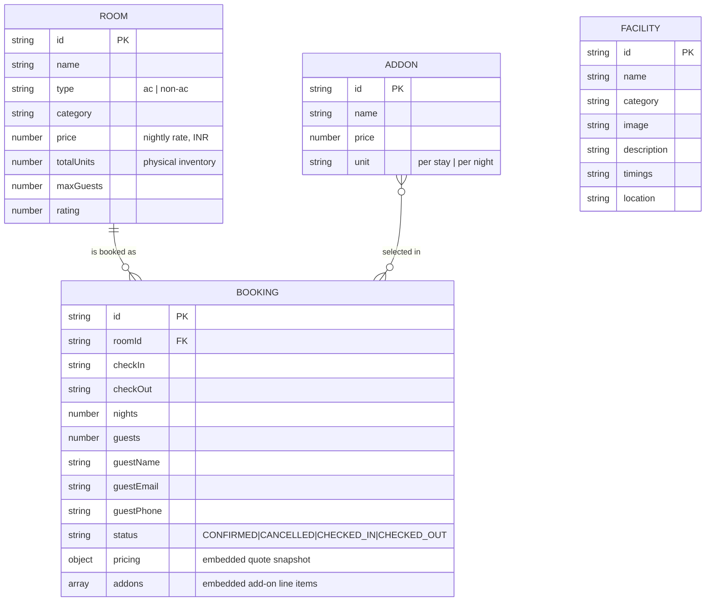

# 10. Database Documentation

## 10.1 Overview

This application does **not** use a normalised relational schema. It uses two kinds of storage, both intentionally simple for a single-property hotel:

1. **Static reference data** — `rooms.json`, `facilities.json`, `addons.json` — hand-authored, loaded into memory once at server boot, never written to at runtime.
2. **Bookings** — the only data that changes at runtime — stored via `backend/store.js` in one of two interchangeable backends:
   - **Postgres** (when `DATABASE_URL` is set): a single table, `bookings`, storing each booking as a `JSONB` document keyed by its ID.
   - **Local JSON file** (`backend/data/bookings.json`, when `DATABASE_URL` is unset): the same booking objects, stored as a JSON array on disk.

Both modes are functionally identical from every route handler's point of view — `server.js` only ever calls `store.list()`, `store.get(id)`, `store.create(booking)`, `store.update(id, patch)`.

## 10.2 Why JSONB-Per-Row Instead of a Normalised Schema

A booking is always read and written as one complete object (there is no query in the entire application that needs, say, "all add-ons across all bookings" independent of their parent booking). Storing it as one `JSONB` document per row avoids a multi-table join for a workload that never needs one, while still getting Postgres's durability and free-tier availability. This is a deliberate, workload-matched decision — not a placeholder for "real" normalisation to be done later.

## 10.3 Entity Overview



`ROOM`, `FACILITY`, and `ADDON` are not literal database tables — they are JSON arrays in `backend/data/`. The diagram models them as entities because `BOOKING` documents embed a **snapshot** of room/add-on pricing at booking time (see §10.5), which is the closest real-world analogue to a foreign-key relationship in this system.

## 10.4 Reference Data — `rooms.json`

6 rows. Full field list (from the actual data file):

| Field | Type | Example | Notes |
|---|---|---|---|
| `id` | string (PK) | `"deluxe-ac"` | kebab-case, used as the FK from bookings |
| `name`, `description` | string | | |
| `type` | string | `"ac"` / `"non-ac"` | drives the Rooms-page filter |
| `category` | string | `"Deluxe"`, `"Budget"`, `"Executive"`, `"Family"`, `"Standard"` | |
| `price` | number | `1499` | nightly rate in INR; also the GST-slab key (§9.7) |
| `image`, `gallery` | string / string[] | `/images/southindia/...` | served from `frontend/public/` |
| `amenities` | string[] | `["AC","Free WiFi",...]` | drives both the Room Details amenity grid and the Compare page checklist |
| `maxGuests` | number | `3` | booking-time capacity check |
| `bedType`, `sizeSqft`, `floor` | string / number / string | | display-only |
| `totalUnits` | number | `8` | physical room count — the denominator for availability |
| `rating`, `reviewCount` | number | `4.6`, `128` | static, not derived from real reviews |

The six rooms: `standard-non-ac` (₹899, 10 units), `standard-ac` (₹1299, 12 units), `deluxe-ac` (₹1499, 8 units), `executive-ac` (₹1899, 6 units), `family-ac` (₹2199, 4 units), `budget-single` (₹649, 6 units). Total physical inventory: **46 rooms**.

## 10.5 Bookings — Document Shape

A booking, exactly as persisted (Postgres `JSONB` value or JSON-file array element):

```json
{
  "id": "PHR-E977A39F",
  "roomId": "standard-non-ac",
  "roomName": "Standard Non-AC Room",
  "roomImage": "/images/southindia/hotel-room-3.jpg",
  "checkIn": "2026-09-10", "checkOut": "2026-09-12", "nights": 2,
  "guests": 1,
  "guestName": "Test User", "guestEmail": "t@example.com", "guestPhone": "9876543210",
  "requests": "",
  "paymentMethod": "card",
  "pricing": { "...full quote object, see 9.7...": true },
  "status": "CONFIRMED",
  "createdAt": "2026-09-05T16:54:19.476Z",
  "updatedAt": "2026-09-05T16:54:25.138Z"
}
```

`roomName` and `roomImage` are **copied** onto the booking at creation time rather than re-joined from `rooms.json` on every read — this means a booking's receipt stays accurate even if a room were later renamed or re-imaged (a deliberate denormalisation for historical-record correctness, not an oversight).

## 10.6 Postgres Schema (when `DATABASE_URL` is set)

Created automatically on boot by `store.init()` — no separate migration tool or `.sql` file exists:

```sql
CREATE TABLE IF NOT EXISTS bookings (
  id   TEXT PRIMARY KEY,
  data JSONB NOT NULL
);
```

| Operation | Query |
|---|---|
| List all | `SELECT data FROM bookings ORDER BY id` |
| Get one | `SELECT data FROM bookings WHERE id = $1` |
| Create | `INSERT INTO bookings (id, data) VALUES ($1, $2::jsonb)` |
| Update | read-modify-write: fetch existing `data`, shallow-merge the patch in application code, `UPDATE bookings SET data = $2::jsonb WHERE id = $1` |

No secondary indexes exist beyond the primary key. At the data volumes this application targets (a single hotel's booking history), a full-table scan per list/filter operation is not a practical concern — see [22-performance-scalability.md](22-performance-scalability.md).

## 10.7 Data Lifecycle

| Event | What happens |
|---|---|
| Booking created | `POST /api/bookings` → `store.create()` → row inserted, `status: CONFIRMED` |
| Guest self-cancels | `PATCH .../:id {status: CANCELLED}` → `store.update()` merges `status` + `updatedAt` |
| Staff changes status | Same `store.update()` path, but behind `requireAdmin` |
| Server restart (Postgres mode) | Rows persist — Neon/Supabase Postgres survive process restarts and redeploys |
| Server restart (JSON-file mode) | Rows persist **only if the disk itself persists** — true for local development, **not** guaranteed on Render's free tier (no persistent disk on that plan) — see [18-deployment.md](18-deployment.md) |
| Booking deletion | **Not implemented.** There is no delete endpoint; a booking can only be cancelled (soft state change), never removed |

## 10.8 Data Integrity Notes

- **No unique constraint on `guestEmail`** — nothing prevents (or is meant to prevent) the same email from being used across many separate bookings; this is intentional, since guest identity is just contact information, not an account.
- **No foreign-key enforcement** between `booking.roomId` and `rooms.json`** — because rooms live in a separate JSON file, not the same database, there is no database-level constraint stopping a booking from referencing a room ID that no longer exists in `rooms.json`. In practice this can't happen through the API (the room is validated to exist before a booking is created), but it is a structural gap worth naming for anyone extending the room catalogue.
- **`totalUnits` is not decremented anywhere** — availability is always computed live (`totalUnits` minus currently-overlapping active bookings), never stored as a running counter, which is what makes the availability figure self-correcting and race-condition-resistant (see §9.5's "re-check at booking time" step).
