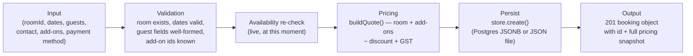
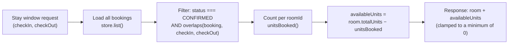

# 12. Data Processing

This application does not perform batch data processing, ETL, or analytics pipelines — it is a transactional booking system. This document covers the one meaningful "processing pipeline" that exists: turning a guest's selections into a persisted, priced booking.

## 12.1 Booking Creation Pipeline

### Input
Raw JSON body from `POST /api/bookings` — entirely guest-supplied except `status`/`id`/`createdAt`, which the server assigns.

### Validation
Multi-stage, fail-fast, each stage returning immediately on the first failure (see [09-api-documentation.md](09-api-documentation.md) §9.5 for the exact order and status codes). Every validation rule mirrors a rule already enforced client-side in `Checkout.js` — the server is the authoritative copy, the client copy exists purely to give the guest instant feedback.

### Transformation
- Dates are kept as raw ISO strings (`YYYY-MM-DD`) throughout — no timezone conversion is performed beyond treating every date as UTC midnight for comparison purposes (`parseDate` appends `T00:00:00Z`).
- `guestName`, `guestEmail` are trimmed before storage.
- `requests` defaults to an empty string and is coerced to a string + trimmed.

### Availability Check (the "processing" step with real consequences)
This is not a duplicate of the earlier search-time check — it re-reads the **current** bookings list at the moment of creation, so a room that sold out in the seconds between the guest opening the Payment page and tapping "Confirm Booking" is caught here, not silently oversold.

### Pricing Calculation
`buildQuote(room, nights, addonIds)` — pure function, no side effects, deterministic given its inputs (see [11-business-logic.md](11-business-logic.md) for the formula). Called once here and once per `/api/quote` request; never duplicated or reimplemented elsewhere.

### Output / Storage
The assembled booking object is handed to `store.create()`, which either inserts a Postgres row or appends-and-rewrites the JSON file, then is returned to the client verbatim as the 201 response — the frontend does not need a follow-up read to get the final, authoritative booking record.

## 12.2 Availability Computation Pipeline (read path)

This runs on every call to `/api/rooms` (with dates), `/api/rooms/:id` (with dates), and `/api/availability` — it is a full re-computation each time (no caching layer), which is appropriate at this data scale (see [22-performance-scalability.md](22-performance-scalability.md)).

## 12.3 What Is *Not* Processed

- No image processing/resizing pipeline — room photos are pre-sized static files served as-is from `frontend/public/images/`.
- No search indexing — room/facility lookups are simple in-memory array filters over a handful of records, not a search engine.
- No analytics/event pipeline — no click tracking, funnel analysis, or usage telemetry is collected anywhere in the codebase.
- No email/notification dispatch pipeline — see [16-integrations.md](16-integrations.md) and [24-known-issues.md](24-known-issues.md) for the gap between the "we've sent the details to your email" confirmation copy and actual behaviour.
